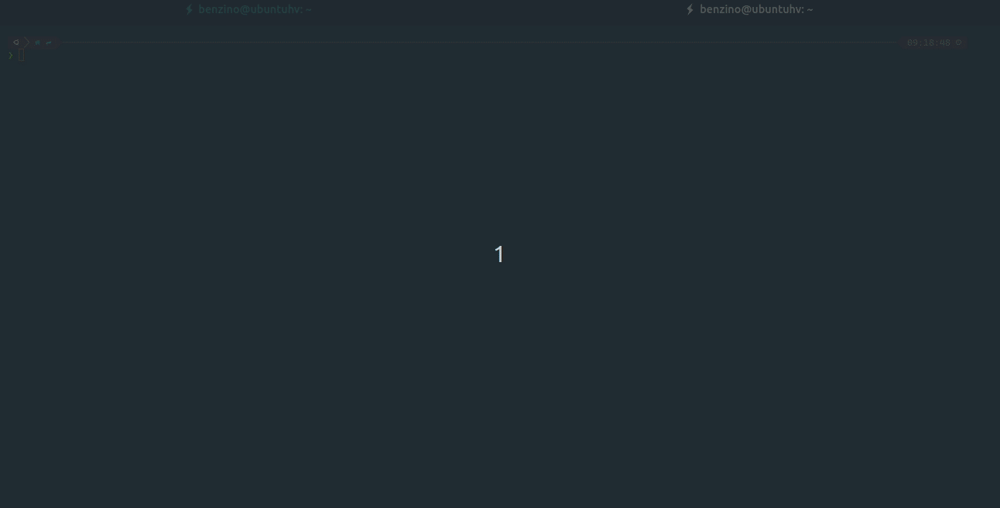
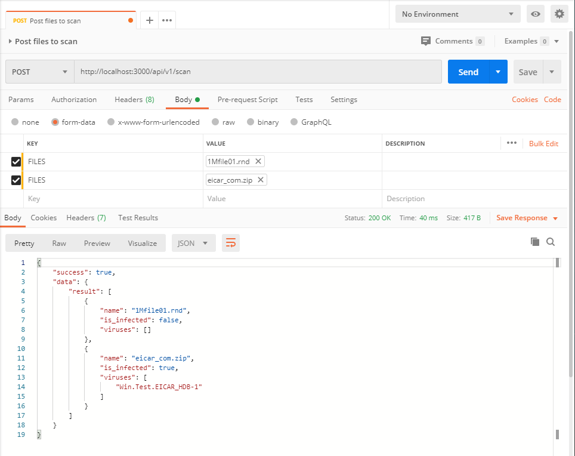

#### Overview

This is a simple implementation of REST API for ClamAV virus scanner. You can use it to scan files uploaded by users, before they are saved or put into final destination, or to scan files on demand.



#### How to start clamav-rest-api?

First of all you have to have running ClamAV instance configured to accept TCP connections from `clamav-rest-api` instances. For more details I will guide you to CalmAV documentation ([here](https://blog.clamav.net/2016/06/regarding-use-of-clamav-daemons-tcp.html) and [here](https://www.clamav.net/documents/configuration#clamdconf)) but it's enough to say that you need `TCPSocket 3310` and eventually `TCPAddr` in your `clamd.conf` file. The easiest way is to use docker image with ClamAV already configured. I'm using `clamav/clamav` docker [image](https://hub.docker.com/r/clamav/clamav) during tests and development.

**_Note_:**
You have to give `clamav/clamav` a minute to start because it needs to refresh signatures from ClamAV servers (update its viruses database).

**_Recommended_** way of using `clamav-rest-api` is to start it as docker container or on k8s cluster (see [Configuration](#Configuration) below):

In [examples](./examples/k8s) directory there are kubernetes YAML files to create `configMap`, `deployments` and `services`. Just run `kubectl` command to create them in proper order:

```bash
kubectl apply -f cra-configmap.yml
kubectl apply -f clamavd.yml
kubectl apply -f cra.yml
```

`clamav-rest-api` service is published on `nodePort` 30080. On cluster network it is available on port 3000.

To start using clamav-rest-api on docker environment follow the steps below:

```
docker run -d -p 8080:8080 \
-e NODE_ENV=production \
-e APP_PORT=8080 \
-e APP_FORM_KEY=FILES \
-e CLAMD_IP=192.168.10.10 \
benzino77/clamav-rest-api
```

or

```
docker run -d -p 8080:8080 -v /local/path/to/.env:/clamav-rest-api/.env benzino77/clamav-rest-api
```

or, if you are running docker in Swarm mode, you can use `configs`

```
docker config create cra /path/to/.env
docker service create --name clamav-rest-api --publish published=8080,target=8080 --config src=cra,target="/clamav-rest-api/.env" benzino77/clamav-rest-api
```

There is also an [example](./examples/docker-compose.yml) how to run _full_ stack on docker Swarm (clamavd and clamav-rest-api combined):

```
docker stack deploy -c docker-compose.yml cra
```

You can also start `clamav-rest-api` by cloning the repo and run commands listed below:

```
npm install
npm install -D # if you want to run tests or examples
# Configuration described below - needed before start app
npm start
```

##### Configuration

`clamav-rest-api` needs some information to run properly. For example it needs to know where to find ClamAV. This kind of information can be provided by `.env` file or by setting environemnt variables. Example `.env` file can be find [here](./.env.example). What you need to do is to copy `.env.example` file to `.env` and edit it to provide configuration parameters which meet your needs.
Here is a short description of those parameters:

- `NODE_ENV` - describe application environment (production, development, test, etc.)
- `APP_PORT` - port number on which `clamav-rest-api` will listen to requests
- `APP_FORM_KEY` - form key (element name) used when uploading files to scan (see [examples directory](examples/)). `clamav-rest-api` will only accept files uploaded with this form key.
- `APP_MORGAN_LOG_FORMAT` - log format used by `clamav-rest-api` to display information about requests. More infor can be found [here](https://github.com/expressjs/morgan#predefined-formats)
- `APP_MAX_FILE_SIZE` - max size (in bytes) of **single** file which will be accepted by `clamav-rest-api`. You have to also take care of `MaxScanSize`, `MaxFileSize`, etc. in your `clamd.conf` file.
- `APP_MAX_FILES_NUMBER` - maximum number of files uploaded to scan
- `CLAMD_IP` - ClamAV IP adress
- `CLAMD_PORT` - ClamAV listen port
- `CLAMD_TIMEOUT`- ClamAV timeout connection in miliseconds

As stated before you can set all those parameters by setting environment variables:

_Linux/MacOSX_

```
export APP_PORT=8080
export NODE_ENV=production
export CLAMD_IP=localhost
export APP_FORM_KEY=FILES
npm start
```

or

```
APP_PORT=8080 NODE_ENV=production CLAMD_IP=clamavd CLAMD_IP=localhost APP_FORM_KEY=FILES npm start
```

#### API endpoints

There are only two API endpoints:

`POST /api/v1/scan` - to scan files (see [examples](#Examples))

`GET /api/v1/version` - to get ClamAV version

#### Examples

##### wget example

Oooops: _Wget does not currently support "multipart/form-data" for transmitting POST data_

##### curl example

```
❯ curl -s -XPOST http://localhost:3000/api/v1/scan -F FILES=@src/tests/1Mfile01.rnd -F FILES=@src/tests/eicar_com.zip | jq
{
  "success": true,
  "data": {
    "result": [
      {
        "name": "1Mfile01.rnd",
        "is_infected": false,
        "viruses": []
      },
      {
        "name": "eicar_com.zip",
        "is_infected": true,
        "viruses": [
          "Win.Test.EICAR_HDB-1"
        ]
      }
    ]
  }
}
```

##### httpie example

```
❯ http --form POST http://localhost:3000/api/v1/scan FILES@src/tests/1Mfile01.rnd FILES@src/tests/eicar_com.zip
HTTP/1.1 200 OK
Access-Control-Allow-Origin: *
Connection: keep-alive
Content-Length: 172
Content-Type: application/json; charset=utf-8
Date: Sun, 07 Jun 2020 10:11:34 GMT
ETag: W/"ac-dmIyPllIezz2lPUbemX0zYljm9w"
X-Powered-By: Express

{
    "data": {
        "result": [
            {
                "is_infected": false,
                "name": "1Mfile01.rnd",
                "viruses": []
            },
            {
                "is_infected": true,
                "name": "eicar_com.zip",
                "viruses": [
                    "Win.Test.EICAR_HDB-1"
                ]
            }
        ]
    },
    "success": true
}
```

##### Postman example



##### Client and server side examples

Simple examples how to call `clamav-rest-api` (from client/browser side) using form action and axios library can be found in [examples/html](./examples/html) directory.

Server side examples (Node.js) using axios, fetch and request library can be found in [examples/nodejs](./examples/nodejs) directory.

There is also simple Python [example](./examples/python) using `requests` library.
